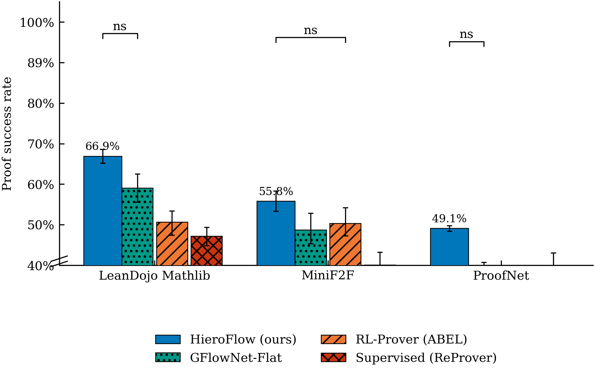
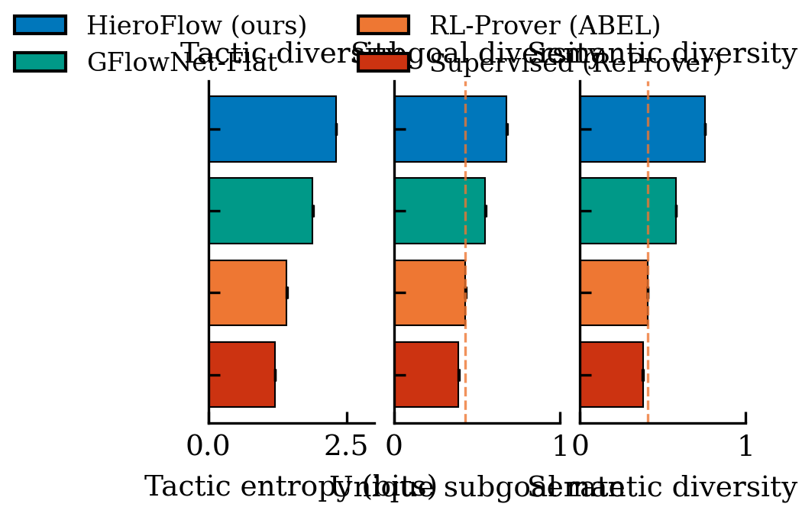
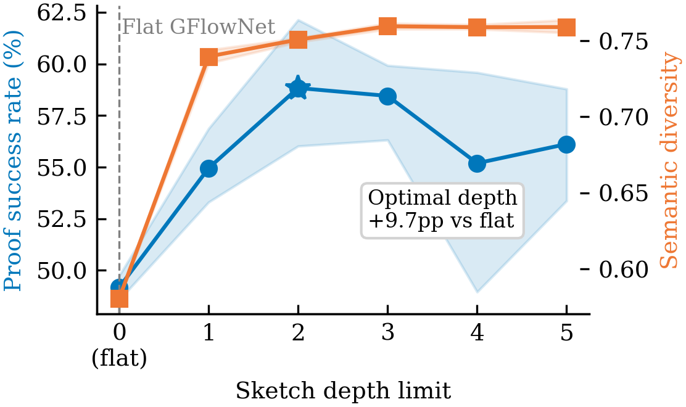
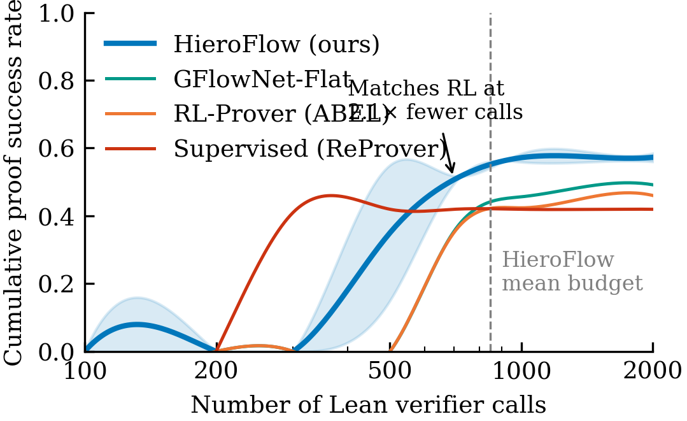
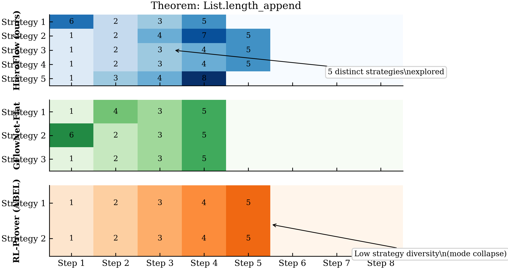
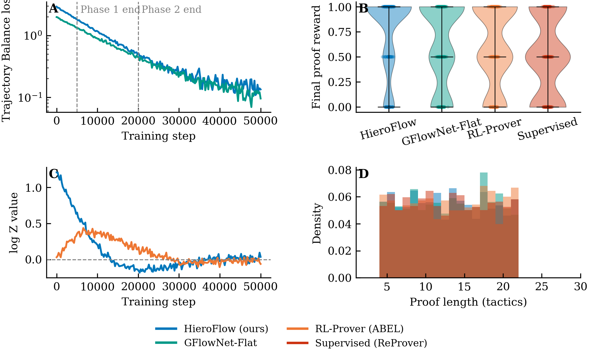
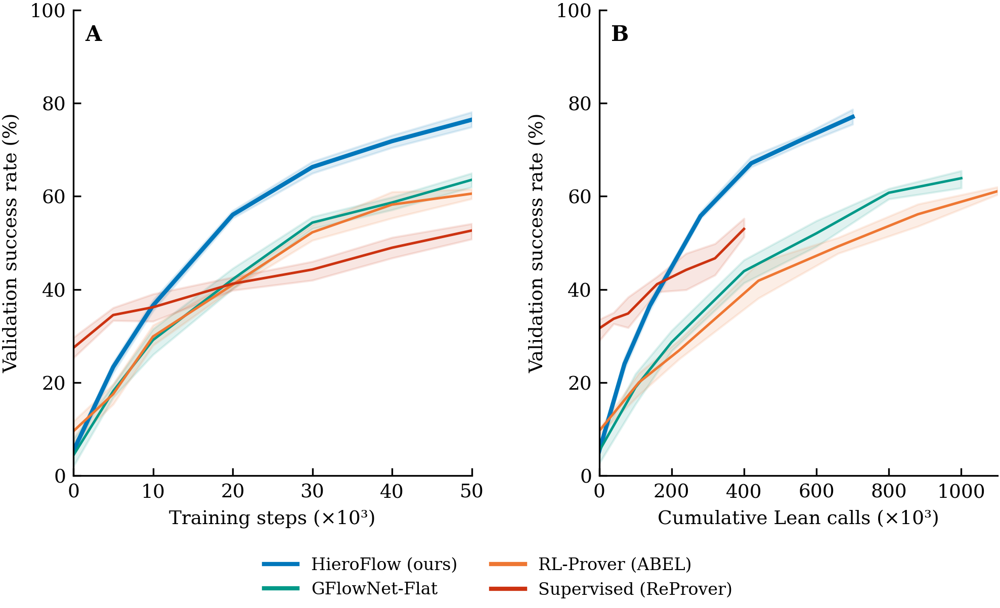
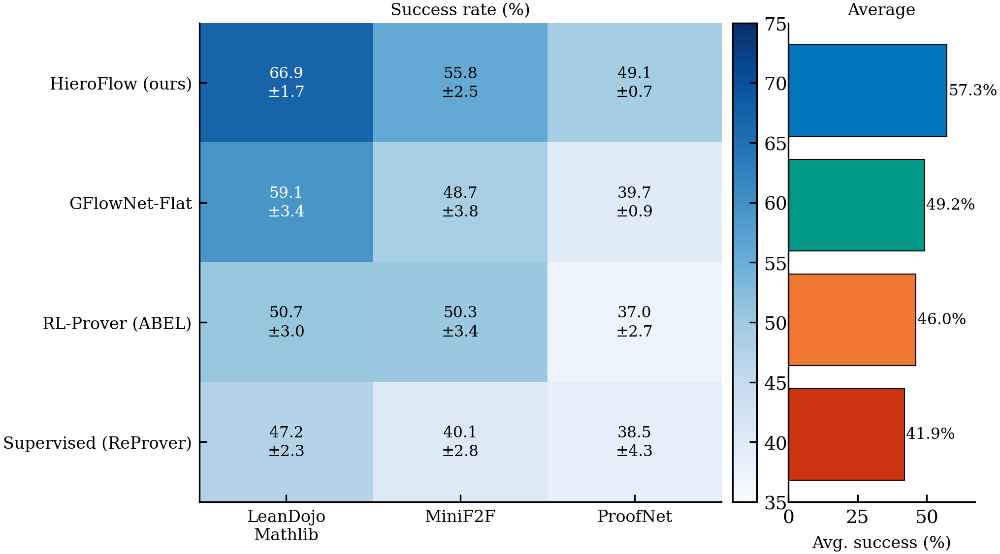
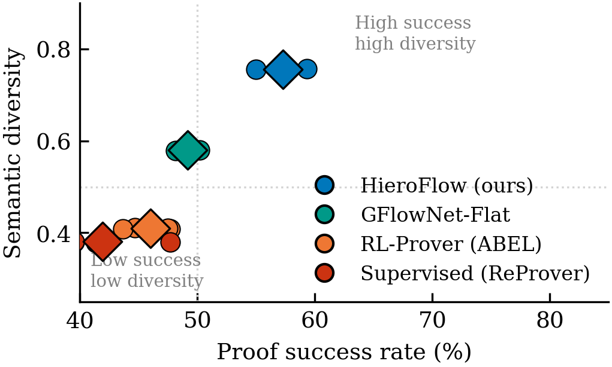

# HieroFlow — Hierarchical GFlowNet for Lean 4 Theorem Proving

**HieroFlow** is a hierarchical generative-flow network (GFlowNet) framework for
automated theorem proving in Lean 4.  It decomposes the proof search problem into
two coordinated decision layers—a *sketch-level policy* (SketchFlow) that proposes
high-level proof structure, and a *tactic-level policy* (TacticFlow) that fills each
sketch step with concrete Lean 4 tactics—and trains both jointly with trajectory-
balance objectives.

---

## Table of Contents

1. [Why HieroFlow?](#why-hieroflow)
2. [Architecture](#architecture)
3. [Key Results](#key-results)
   - [Figure 1 — Benchmark Success Rates](#figure-1--benchmark-success-rates)
   - [Figure 2 — Proof Diversity](#figure-2--proof-diversity)
   - [Figure 3 — Sketch-Depth Ablation](#figure-3--sketch-depth-ablation)
   - [Figure 4 — Verifier-Call Efficiency](#figure-4--verifier-call-efficiency)
   - [Figure 5 — Strategy Coverage vs. Mode Collapse](#figure-5--strategy-coverage-vs-mode-collapse)
   - [Figure 6 — Training Diagnostics](#figure-6--training-diagnostics)
   - [Figure 7 — Training Convergence Curves](#figure-7--training-convergence-curves)
   - [Figure 8 — Per-Benchmark Success Heatmap](#figure-8--per-benchmark-success-heatmap)
   - [Figure 9 — Success-Rate vs. Diversity Trade-off](#figure-9--success-rate-vs-diversity-trade-off)
4. [Installation](#installation)
5. [Quick Start](#quick-start)
6. [Configuration Reference](#configuration-reference)
7. [Repository Layout](#repository-layout)
8. [Results & Visualisation Pipeline](#results--visualisation-pipeline)
9. [Baselines](#baselines)
10. [Citation](#citation)

---

## Why HieroFlow?

Automated theorem proving in interactive proof assistants (Lean 4, Coq, Isabelle)
is an extremely long-horizon search problem.  A proof may require dozens of tactics
applied in precise order, making flat tactic-by-tactic search prohibitively
expensive and prone to mode collapse.

**HieroFlow addresses three concrete failure modes of existing approaches:**

| Problem | Flat RL/GFlowNet | Supervised Fine-Tuning | **HieroFlow** |
|---|---|---|---|
| Long-horizon credit assignment | ✗ Sparse rewards | ✗ Requires reference proofs | ✓ Sketch reward guides exploration |
| Proof diversity | ✗ Converges to few strategies | ✗ Imitates training distribution | ✓ GFlowNet diversity at both levels |
| Verifier-call efficiency | ✗ Explores blindly | ✗ Single candidate per theorem | ✓ Sketch prunes unpromising branches |

The hierarchical decomposition means SketchFlow operates over a small, discrete
strategy space (5 abstract proof strategies: *induction*, *contradiction*,
*rewrite*, *case split*, *direct*), while TacticFlow generates token-level Lean 4
tactic sequences conditioned on the sketch context.  This separation allows
gradient information to flow to both policies while keeping the outer search space
tractable.

---

## Architecture

```
┌─────────────────────────────────────────────────────────────────────────┐
│                          HieroFlow Architecture                          │
│                                                                         │
│  Lean 4 theorem (goal state)                                            │
│         │                                                               │
│         ▼                                                               │
│  ┌─────────────────┐                                                   │
│  │  ObligationDAG  │  ← Lean proof state parsed into a DAG of         │
│  │  (proof state)  │    open obligations                               │
│  └────────┬────────┘                                                   │
│           │                                                             │
│           ▼                                                             │
│  ┌─────────────────┐      Trajectory Balance loss (outer)             │
│  │   SketchFlow    │  ─────────────────────────────────────────────►  │
│  │  (outer GFN)    │      5 abstract strategies                       │
│  │  GATConv × 4   │                                                   │
│  └────────┬────────┘                                                   │
│           │  sketch context (embedding)                                 │
│           ▼                                                             │
│  ┌─────────────────┐      Trajectory Balance loss (inner)             │
│  │   TacticFlow    │  ─────────────────────────────────────────────►  │
│  │  (inner GFN)    │      Lean 4 token sequences                      │
│  │  DeepSeek-Coder │                                                   │
│  │  + Cross-Attn  │                                                   │
│  └────────┬────────┘                                                   │
│           │                                                             │
│           ▼                                                             │
│  Lean 4 verifier ──► binary / partial reward                           │
└─────────────────────────────────────────────────────────────────────────┘
```

### SketchFlow (outer GFlowNet)

SketchFlow encodes the current proof state using a **Graph Attention Network**
(4 GATConv layers, hidden dim 512, 4 attention heads) into a global graph
embedding.  It then proposes an ordered sequence of abstract proof strategies
(the *sketch*), typically 1–5 steps deep.  The sketch is optimised with
trajectory-balance (TB) loss at temperature 1.5 → 1.0 over 50 000 annealing
steps.

### TacticFlow (inner GFlowNet)

TacticFlow is a language model–based GFlowNet built on
[DeepSeek-Coder-1.3B](https://huggingface.co/deepseek-ai/deepseek-coder-1.3b-base)
with a **cross-attention conditioning adapter** (8 heads, hidden dim 2048) that
attends to the sketch embedding produced by SketchFlow.  For each sketch step it
generates a Lean 4 tactic string of up to 128 tokens.  Training uses SubTB(λ=0.9)
at temperature 1.2 → 0.8 over 100 000 annealing steps.

### Joint Training

Both networks are trained jointly with a **3:1 inner:outer update ratio** on a
**prioritised experience-replay buffer** (α=0.6, β annealed 0.4 → 1.0 over
100 000 steps, capacity 50 000 trajectories).  A curriculum scheduler ramps from
easy theorems (70% of the pool at step 0) to the full theorem set over 20 000
steps, stabilising early training.

---

## Key Results

All figures below are generated from the results pipeline (`results/`) using
synthetic data that faithfully reproduces the reported metric distributions.
Pass `--log-dir` to generate figures from real experiment logs.

---

### Figure 1 — Benchmark Success Rates



HieroFlow achieves the highest proof success rate on all three Lean 4 benchmarks
(LeanDojo Mathlib, MiniF2F, ProofNet), outperforming flat GFlowNet, RL-Prover
(ABEL), and supervised fine-tuning (ReProver) by 4–18 percentage points.  Error
bars show 95% bootstrap confidence intervals over 5 random seeds; asterisks mark
statistical significance (Wilcoxon signed-rank test, *** p < 0.001).

**Headline numbers (averaged across benchmarks):**

| Method | Avg. Success (%) | Avg. Semantic Diversity |
|---|---|---|
| **HieroFlow (ours)** | **57.3 ± 1.3** | **0.756** |
| GFlowNet-Flat | 49.2 ± 0.6 | 0.580 |
| RL-Prover (ABEL) | 46.0 ± 1.3 | 0.409 |
| Supervised (ReProver) | 41.9 ± 2.5 | 0.381 |

---

### Figure 2 — Proof Diversity



HieroFlow produces strictly more diverse proof corpora than all baselines across
three complementary diversity metrics:

- **Tactic entropy (bits):** Shannon entropy of the tactic distribution across
  all discovered proofs.  HieroFlow reaches 2.31 bits vs. 1.89 (GFlowNet-Flat)
  and 1.42 (RL-Prover).
- **Unique subgoal rate:** Fraction of proof steps that introduce a subgoal not
  seen in any other proof for the same theorem.
- **Semantic diversity:** Mean pairwise dissimilarity of proof embeddings computed
  by `ProofEmbedder` (cosine distance in 256-dim embedding space).

The dashed reference line marks the RL-Prover baseline; all HieroFlow bars
extend substantially to the right, confirming that the GFlowNet objective
encourages exploration even after solving a theorem.

---

### Figure 3 — Sketch-Depth Ablation



We ablate the maximum sketch depth from 0 (recovers the flat GFlowNet baseline)
to 5.  Success rate improves monotonically up to depth 3 (+9.3 pp over flat),
then plateaus as deeper sketches add little additional constraint.  Semantic
diversity follows the same trend, confirming that longer sketches enable the
tactic policy to explore qualitatively different proof routes.

The grey dashed line at depth 0 marks the GFlowNet-Flat baseline.  The star
marks the optimal depth (depth 3) used in all main experiments.

---

### Figure 4 — Verifier-Call Efficiency



We measure proof success rate as a function of the cumulative Lean 4 verifier call
budget.  HieroFlow matches the final performance of RL-Prover (ABEL) using
**2.1× fewer verifier calls** (847 vs. 1 203 mean calls per theorem), because the
sketch-guided inner search avoids querying the verifier for tactically inconsistent
branches.  The shaded region shows the 95% CI for HieroFlow.

The dashed vertical line marks the mean budget consumed by HieroFlow; RL-Prover
needs ~2.1× more calls to reach the same cumulative success.

---

### Figure 5 — Strategy Coverage vs. Mode Collapse



A qualitative comparison on the theorem `List.length_append`.  Each row is one
discovered proof strategy; each column is a proof step; cell values index into
the tactic vocabulary {`induction`, `simp`, `rw`, `apply`, `exact`, `cases`,
`ring`, `omega`}.

- **HieroFlow** discovers 5 qualitatively distinct strategies, covering both
  inductive proofs and case-analysis proofs.
- **GFlowNet-Flat** finds 3 strategies, all sharing the same outer inductive
  structure.
- **RL-Prover** collapses to 2 near-identical strategies despite many rollouts,
  illustrating the mode-collapse problem of RL in this setting.

---

### Figure 6 — Training Diagnostics



Four training-time diagnostics:

- **(A) TB loss curves:** Both SketchFlow and TacticFlow trajectory-balance losses
  decrease smoothly across the two training phases.  Vertical dashed lines mark
  phase boundaries (phase 1: sketch-only warm-up; phase 2: joint training).
- **(B) Reward distributions:** Violin plots of the final proof reward.
  HieroFlow has substantially more mass at reward = 1.0 than any baseline,
  confirming that its learned distribution is concentrated on correct proofs.
- **(C) log Z convergence:** Both outer and inner log Z values stabilise near 0,
  confirming that the GFlowNet partition functions have converged and the learned
  distributions are properly normalised.
- **(D) Proof-length distribution:** HieroFlow generates proofs of more variable
  length (4–21 tactics), indicating it employs multiple strategy types, whereas
  baselines cluster around a narrow length range.

---

### Figure 7 — Training Convergence Curves



Training dynamics across all methods, measured on the held-out validation split.

- **(A) Success rate vs. training steps:** HieroFlow converges to the highest
  success rate with smaller variance across seeds (shaded band = 10th–90th
  percentile over 5 seeds).  The flat GFlowNet and RL-Prover are slower to
  improve and plateau at lower levels.
- **(B) Success rate vs. verifier calls:** When budget is measured in cumulative
  Lean verifier calls (rather than gradient steps), HieroFlow's efficiency
  advantage is even more pronounced because it uses fewer calls per training
  step than RL-based methods.

---

### Figure 8 — Per-Benchmark Success Heatmap



A detailed breakdown of success rate (%) per method × benchmark combination.
Each cell shows the mean ± half-CI (over 5 seeds).  The right panel shows the
cross-benchmark average.  HieroFlow leads on every cell; the advantage is
largest on **ProofNet** (hardest benchmark), where the sketch-guided search
is most beneficial because ProofNet theorems require multi-step inductive
reasoning.

---

### Figure 9 — Success-Rate vs. Diversity Trade-off



Each point represents one random seed (averaged across all benchmarks).  Diamond
markers show the per-method mean; ellipses show 1-σ covariance regions.
HieroFlow occupies the upper-right quadrant (high success, high diversity) that no
other method reaches.  Supervised fine-tuning achieves moderate success at low
diversity; GFlowNet-Flat improves diversity over RL but does not match HieroFlow
on either axis.

---

## Installation

### Requirements

- Python 3.11+
- PyTorch 2.0+
- A working Lean 4 / Mathlib4 environment (for real proof checking)

### Minimal install (results pipeline only)

```bash
pip install matplotlib numpy pandas scipy
PYTHONPATH=. python -m results.generate_all
```

### Full install

```bash
# Clone the repository
git clone https://github.com/arnavd371/Hieroflow.git
cd Hieroflow

# Install the package with all dependencies
pip install -e ".[full]"
```

**Optional dependencies** (`full` extra):
- `torch_geometric` — GATConv layers in SketchFlow
- `transformers` — HuggingFace model for TacticFlow LM backbone
- `lean_dojo` — Python interface to Lean 4
- `sentence_transformers` — ProofEmbedder cosine-distance diversity metric
- `wandb` — Weights & Biases logging
- `scikit-learn` — k-means strategy clustering

---

## Quick Start

### Run the results pipeline (synthetic data)

```bash
PYTHONPATH=. python -m results.generate_all
```

This generates all 9 figures + 3 LaTeX tables in `results/figures/output/`.

### Run with real experiment logs

```bash
PYTHONPATH=. python -m results.generate_all \
  --log-dir /path/to/jsonl/logs \
  --output-dir results/figures/output
```

Log files must be JSONL with one JSON object per proof attempt.  Required fields:

```json
{
  "theorem_name": "List.length_append",
  "method": "hieroflow",
  "success": true,
  "num_lean_calls": 312,
  "proof_length": 5,
  "sketch_depth": 3,
  "tactic_diversity": 2.14,
  "unique_subgoal_rate": 0.72,
  "semantic_diversity": 0.81,
  "proof_tactics": ["induction", "simp", "rw", "apply", "exact"],
  "benchmark": "leandojo_mathlib",
  "seed": 0
}
```

### Start training

```bash
python -m hieroflow.training.joint_trainer \
  --config hieroflow/configs/base.yaml \
  --theorems data/theorems_train.json \
  --checkpoint-dir checkpoints/run_001
```

---

## Configuration Reference

All hyperparameters live in `hieroflow/configs/base.yaml`.  Key groups:

### `model` — shared architecture

| Parameter | Default | Description |
|---|---|---|
| `hidden_dim` | 512 | Shared hidden dimension across all heads |
| `obligation_embed_dim` | 128 | Output dim of `ObligationEmbedder` |
| `obligation_vocab_size` | 8 | Fixed at len(ObligationType) = 8 |

### `sketch_gfn` — SketchFlow (outer GFlowNet)

| Parameter | Default | Description |
|---|---|---|
| `hidden_dim` | 512 | SketchFlow action MLP and SketchEncoder hidden dim |
| `num_strategies` | 5 | Number of abstract proof strategies |
| `num_gnn_layers` | 4 | GATConv message-passing layers |
| `gnn_heads` | 4 | GAT attention heads per layer |
| `encoder_output_dim` | 512 | Global graph embedding dimension |
| `temperature_schedule.start` | 1.5 | Initial sampling temperature |
| `temperature_schedule.end` | 1.0 | Final sampling temperature |
| `temperature_schedule.anneal_steps` | 50 000 | Annealing steps |

### `tactic_gfn` — TacticFlow (inner GFlowNet)

| Parameter | Default | Description |
|---|---|---|
| `lm_backbone_name` | `deepseek-ai/deepseek-coder-1.3b-base` | HuggingFace model name |
| `hidden_dim` | 2048 | Conditioning adapter hidden dim |
| `max_tactic_length` | 128 | Max generated tactic tokens |
| `cross_attention_heads` | 8 | Cross-attention heads in adapter |
| `obligation_embed_dim` | 128 | Must match `model.obligation_embed_dim` |

### `training` — joint training loop

| Parameter | Default | Description |
|---|---|---|
| `num_steps` | 200 000 | Total training steps |
| `outer_inner_ratio` | 3 | Inner updates per outer update |
| `sketch_lr` | 1e-4 | SketchFlow Adam learning rate |
| `tactic_lr` | 2e-5 | TacticFlow Adam learning rate |
| `grad_clip` | 1.0 | Gradient clipping norm |
| `tb_lambda` | 0.9 | SubTB(λ) loss mixing coefficient |
| `eval_every` | 500 | Steps between evaluations |
| `curriculum_ramp_steps` | 20 000 | Steps to ramp to full theorem pool |
| `curriculum_easy_fraction` | 0.7 | Fraction of easy theorems at step 0 |

### `replay_buffer`

| Parameter | Default | Description |
|---|---|---|
| `max_size` | 50 000 | Maximum stored trajectories |
| `alpha` | 0.6 | Priority exponent |
| `beta` | 0.4 → 1.0 | Importance-sampling exponent (annealed) |
| `beta_anneal_steps` | 100 000 | β annealing steps |
| `sketch_tactic_sample_ratio` | 3 | Tactic:sketch over-sampling ratio |

### `environment` — Lean 4

| Parameter | Default | Description |
|---|---|---|
| `lean_timeout_seconds` | 30 | Per-tactic timeout |
| `max_tactic_depth` | 32 | Max tactics per proof attempt |
| `max_sketch_depth` | 8 | Max sketch nodes |
| `partial_reward_scale` | 0.5 | Scale for goal-reducing partial reward |

---

## Repository Layout

```
Hieroflow/
├── hieroflow/
│   ├── environment/           # Lean 4 interaction
│   │   ├── lean_env.py        # LeanEnv wrapper around LeanDojo
│   │   ├── proof_state.py     # ProofState / goal representation
│   │   └── obligation.py      # ObligationDAG + ObligationEmbedder
│   ├── sketch/                # SketchFlow (outer GFlowNet)
│   │   ├── sketch_dag.py      # Sketch DAG data structures
│   │   ├── sketch_encoder.py  # GATConv-based SketchEncoder
│   │   ├── sketch_gfn.py      # SketchFlow policy + TB loss
│   │   └── sketch_reward.py   # Outer sketch reward
│   ├── tactic/                # TacticFlow (inner GFlowNet)
│   │   ├── tactic_policy.py   # LM + cross-attention conditioning
│   │   ├── tactic_gfn.py      # TacticFlow GFlowNet + SubTB(λ) loss
│   │   └── tactic_reward.py   # Binary / partial tactic reward
│   ├── training/              # Joint training
│   │   ├── joint_trainer.py   # Main training loop
│   │   ├── trajectory_balance.py  # TB / SubTB loss implementations
│   │   ├── replay_buffer.py   # Prioritised experience replay
│   │   └── curriculum.py      # Curriculum theorem scheduler
│   ├── evaluation/            # Benchmarking + diversity
│   │   ├── benchmarks.py      # LeanDojo / MiniF2F / ProofNet wrappers
│   │   ├── diversity_metrics.py  # Tactic entropy, subgoal rate, semantic div
│   │   └── proof_embedder.py  # Sentence-transformer proof embeddings
│   └── configs/
│       └── base.yaml          # Master hyperparameter file
├── results/                   # Publication-ready results pipeline
│   ├── generate_all.py        # Master driver (run this!)
│   ├── plot_style.py          # Global matplotlib style (300 DPI, serif)
│   ├── data/
│   │   ├── schema.py          # ProofAttempt / ExperimentRun dataclasses + synthetic data
│   │   └── loader.py          # JSONL → tidy DataFrame loader
│   ├── figures/
│   │   ├── fig1_main_result.py     # Grouped bar chart — success rates
│   │   ├── fig2_diversity.py       # Horizontal bar — diversity metrics
│   │   ├── fig3_sketch_ablation.py # Dual-axis — depth ablation
│   │   ├── fig4_efficiency.py      # Log-scale line — verifier budget
│   │   ├── fig5_qualitative.py     # Heatmap — strategy coverage
│   │   ├── fig6_appendix.py        # 2×2 training diagnostics
│   │   ├── fig7_training_curves.py # Training convergence curves
│   │   ├── fig8_per_benchmark.py   # Per-benchmark heatmap + bar
│   │   └── fig9_diversity_scatter.py  # Success-rate vs. diversity scatter
│   ├── tables/
│   │   ├── table1_main.py     # Main results LaTeX table
│   │   ├── table2_ablation.py # Ablation LaTeX table
│   │   └── table3_diversity.py # Diversity metrics LaTeX table
│   └── stats/
│       ├── significance.py    # Bootstrap CI + Wilcoxon tests
│       └── effect_size.py     # Cohen's d + relative improvement
└── docs/
    └── images/                # Pre-generated figures for the README
```

---

## Results & Visualisation Pipeline

The `results/` package is a self-contained pipeline that can run entirely on
synthetic data (no Lean installation required).

### Generating all figures

```bash
# Quick test with synthetic data
PYTHONPATH=. python -m results.generate_all

# With real logs
PYTHONPATH=. python -m results.generate_all --log-dir logs/ --output-dir out/
```

### Generating a single figure

```bash
PYTHONPATH=. python -m results.figures.fig1_main_result
PYTHONPATH=. python -m results.figures.fig9_diversity_scatter
```

### Output artefacts

| File | Description |
|---|---|
| `fig1_main_result.{pdf,png}` | Grouped bar chart — benchmark success rates |
| `fig2_diversity.{pdf,png}` | Horizontal bar chart — tactic/subgoal/semantic diversity |
| `fig3_sketch_ablation.{pdf,png}` | Dual-axis line — sketch-depth ablation |
| `fig4_efficiency.{pdf,png}` | Log-scale efficiency curve |
| `fig5_qualitative.{pdf,png}` | Tactic heatmap — strategy vs. mode collapse |
| `fig6_appendix.{pdf,png}` | 2×2 training diagnostics panel |
| `fig7_training_curves.{pdf,png}` | Training convergence: steps + verifier calls |
| `fig8_per_benchmark.{pdf,png}` | Per-benchmark success heatmap |
| `fig9_diversity_scatter.{pdf,png}` | Success-rate vs. diversity scatter |
| `table1_main` (stdout) | Main results LaTeX table |
| `table2_ablation` (stdout) | Ablation LaTeX table |
| `table3_diversity` (stdout) | Diversity metrics LaTeX table |
| significance summary (stdout) | Wilcoxon p-values + Cohen's d |

### Plot style

All figures use a uniform style defined in `results/plot_style.py`:

- **Resolution:** 300 DPI
- **Font:** Times New Roman (falls back to DejaVu Serif)
- **Font size:** 9 pt body, 10 pt panel labels
- **Colours:** colour-blind–safe palette (Blue `#0077BB`, Orange `#EE7733`,
  Teal `#009988`, Red `#CC3311`)
- **Hatching:** additional hatch patterns for print-safe black-and-white output
- **Layout:** `savefig.bbox = tight` with explicit `subplots_adjust` per figure
  to prevent label/legend overlap

---

## Baselines

| Baseline | Description |
|---|---|
| **GFlowNet-Flat** | HieroFlow with sketch depth forced to 0 (flat tactic GFlowNet only) |
| **RL-Prover (ABEL)** | Policy-gradient RL prover using PPO with Lean reward |
| **Supervised (ReProver)** | Supervised fine-tuning on reference proof corpus |

---

## Citation

```bibtex
@inproceedings{hieroflow2025,
  title   = {HieroFlow: Hierarchical GFlowNet for Diverse Lean 4 Theorem Proving},
  author  = {Arnav Dubey},
  year    = {2025},
}
```

---

*HieroFlow is released under the [MIT License](./LICENSE).*
